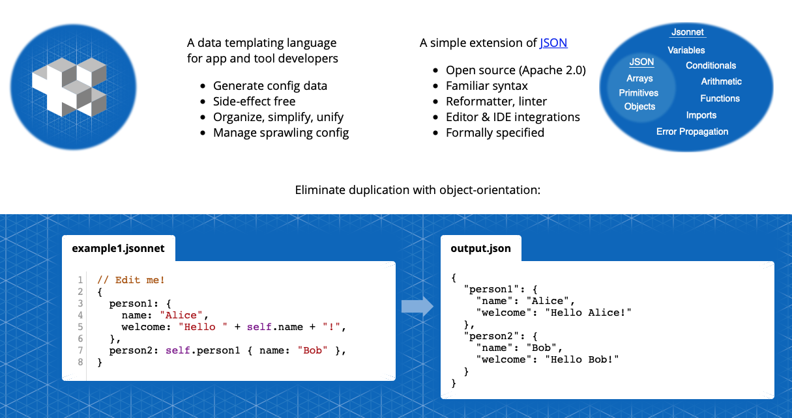

# Jsonnet: Data driven configuration language




## Talk Outline
* Jsonnet overview
* Advantage of data templating over string templating
* Simple example

## Useful Links
* [@olliehughes82](https://twitter.com/olliehughes82)
* [Databricks Jsonnet Style Guide](https://github.com/databricks/jsonnet-style-guide)
* [Grafana Jsonnet tools and mixins](https://github.com/grafana/jsonnet-libs)

## Jsonnet features
* Superset of JSON
* Reuse of data across config files
* Merge data fragments into nested fields
* Transform data output
* [Std lib](https://jsonnet.org/ref/stdlib.html)

## Tools
* [Jsonnet](https://jsonnet.org/)
* [Jsonnet Bundler](https://github.com/jsonnet-bundler/jsonnet-bundler)
* [yq](https://mikefarah.gitbook.io/yq/)
* [jq](https://stedolan.github.io/jq/)
* [Bitnami Kubcfg](https://github.com/bitnami/kubecfg)
* [Jsonnet Intellij Plugin](https://plugins.jetbrains.com/plugin/10852-jsonnet)

Superset of JSON designed for describing cloud resources

## Pros & Cons
✅ Data is smart, text is dumb

✅ Reuse curated "data models"

✅ More machine readable / writable than YAML (because it's data not text)

✅ Excellent at merging or overriding deeply nested data structures

✅ Create "native" functions easily in Go

✅ JVM bindings (integrate with your build easily)

🛑 Can be a hard sell to colleagues

🛑 It has Json in the name

🛑 Looks a bit like the spawn of JSON & Python

🛑 Ugh... It's Icky

## Alternative approaches
* Plain old, duplicated, hand cranked YAML
* Kustomize
* Helm charts

## Output formats
### Arbitary String

**Command**
```
jsonnet -S output-formats-string.jsonnet
```

**Input**
```jsonnet
local devData = import "dev-data.json";
std.format("just a string with a value embedded %s",devData.buildPrefix)
```

**Output**
```
just a string with a value embedded snapshot
```

### Properties file

**Command**
```
jsonnet -S output-formats-properties.jsonnet
```

**Input**
```jsonnet
local devData = import "dev-data.json";
local properties = [
  std.format("app.projectName=%s", devData.projectName),
  std.format("app.commitSha=%s", devData.commitSha),
  std.format("app.minorVersion=%s", devData.minorVersion),
  std.format("app.patchVersion=%s", devData.patchVersion),
  std.format("app.buildPrefix=%s", devData.buildPrefix)
];
std.lines(properties)
```

**Output**
```properties
app.projectName=spring-microservice
app.commitSha=f6b4cd
app.minorVersion=3
app.patchVersion=2
app.buildPrefix=snapsho
```
### YAML
**Command**
```
jsonnet -S output-formats-yaml.jsonnet
```

**Input**
```jsonnet
local devData = import "dev-data.json";

local myData = devData + {
  buildMeta: {
    versions: [1,2,3]
  }
};
std.manifestYamlDoc(myData)
```

**Output**
```yaml
"buildMeta":
  "versions":
  - 1
  - 2
  - 3
"buildPrefix": "snapshot"
"commitSha": "f6b4cd"
"minorVersion": 3
"patchVersion": 2
"projectName": "spring-microservice"
```
🤷‍♂️ It's valid YAML but the quotes are annoying! I prefer to use JSON to render the JSON and use `yq` to convert to YAML


## Simple example

Let's say we want all teams to provide a `build-meta.json` with every release


Each project implements this fragment

```jsonnet
local common = import "build-meta.jsonnet.TEMPLATE";
local devData = import "dev-data.json";

local myConfig = common.newAppMetadata(
  projectName = devData.projectName,
  commitSha = devData.commitSha,
  minorVersion = devData.minorVersion,
  patchVersion = devData.patchVersion,
  buildPrefix = devData.buildPrefix
);
myConfig
```
Which renders the template  [build-meta.jsonnet.TEMPLATE](build-meta.jsonnet.TEMPLATE)
by calling it's constructor with the desired values to populate the template

This command will render the template
`jsonnet build-meta-myapp.jsonnet` 

And render the JSON output
```json
{
  "projectName": "spring-microservice",
  "appMeta": {
    "buildInfo": {
      "commitSha": "f6b4cd",
      "prefix": "SNAPSHOT",
      "releaseNumber": "SNAPSHOT-f6b4cd"
    },
    "versionInfo": {
      "humanized": "1.3.2-SNAPSHOT-f6b4cd",
      "major": 1,
      "minor": 3,
      "patch": 2
    },
    "artifacts": [
      "spring-microservice-1.3.2-SNAPSHOT-f6b4cd.src.jar",
      "spring-microservice-1.3.2-SNAPSHOT-f6b4cd.javadoc.jar",
      "spring-microservice-1.3.2-SNAPSHOT-f6b4cd.bin.jar",
      "spring-microservice-1.3.2-SNAPSHOT-f6b4cd.tar.gz"
    ]
  }
}
```
## Generate a kubernetes deployment and service manifest

Jsonnet Bundler allows curated Jsonnet libs to be installed from Github using a
[jsonnetfile.json](https://github.com/ojhughes/spring-live-jsonnet/blob/master/jsonnetfile.json).

Install the k8s dependency with command `jb install`

We will use a Jsonnet library (.libsonnet extension) that provides helpers for building
a simple k8s manifest: [service-deployment.libsonnet](https://github.com/ojhughes/jsonnet-style-guide/blob/master/service-deployment.libsonnet)
 
The Jsonnet file for generating the manifest looks like this 
```jsonnet
local devData = import "dev-data.json";
local serviceDeployment = import "vendor/service-deployment/service-deployment.libsonnet";
serviceDeployment + {
  serviceName:: devData.projectName,
  dockerImage:: devData.projectName + ":" + devData.projectName,
  serviceConf:: {
    customerName: "foocorp",
    database: "user-db.databricks.us-west-2.rds.amazonaws.com",
  },
}

```

To render the kubernetes manifest
`jsonnet -J vendor k8s-manifest.jsonnet | yq --prettyPrint r -`

the output should be 
```yaml
apiVersion: v1
items:
- kind: Service
  metadata:
    name: spring-microservice
  spec:
    selector:
      serviceName: spring-microservice
- kind: Deployment
  metadata:
    name: spring-microservice
  spec:
    replicas: 1
    template:
      metadata:
        labels:
          name: spring-microservice
      spec:
        containers:
        - env:
            name: SERVICE_CONF
            value: |-
              {
                  "customerName": "foocorp",
                  "database": "user-db.databricks.us-west-2.rds.amazonaws.com"
              }
          image: spring-microservice:spring-microservice
          name: default
          resources:
            requests:
              cpu: 500m
              memory: 250Mi
kind: List
```
